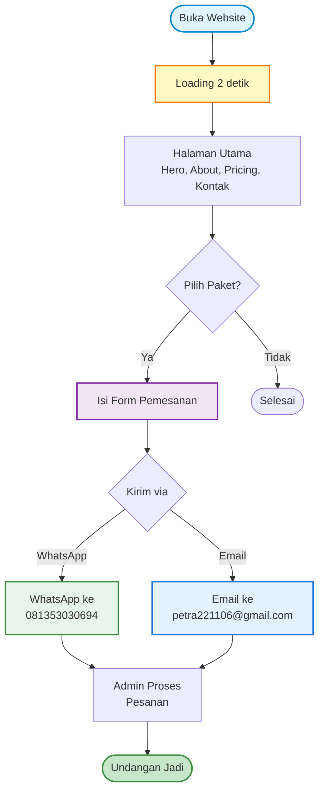
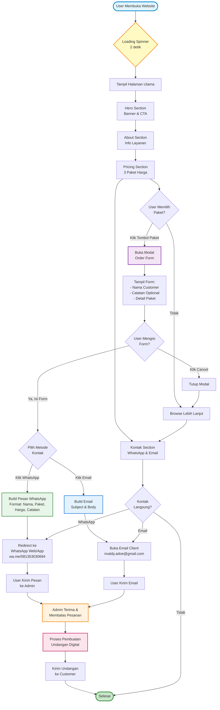

# Flowchart Sistem Undangan Digital

## Alur Kerja Sistem

---

## Alur Detail (Lengkap)

---

## Penjelasan

### Alur Utama:
1. **User membuka website** → Loading spinner tampil selama 2 detik
2. **Halaman utama** ditampilkan dengan 4 section:
   - Hero Section (Banner & CTA)
   - About Section (Info Layanan)
   - Pricing Section (3 Paket Harga)
   - Kontak Section (WhatsApp & Email)

### Proses Pemesanan:
1. User memilih salah satu dari 3 paket di Pricing Section
2. Modal terbuka dengan form pemesanan:
   - Input Nama Customer
   - Input Catatan (Optional)
   - Tampil Detail Paket yang dipilih
3. User memilih metode kontak:
   - **WhatsApp**: Redirect ke wa.me/081353030694 dengan pesan otomatis
   - **Email**: Buka email client ke rivaldy.adoe@gmail.com

### Pengiriman & Proses:
1. Pesan/Email dikirim ke admin
2. Admin menerima dan membalas pesanan
3. Proses pembuatan undangan digital
4. Undangan dikirim ke customer

### Alternatif Flow:
- User bisa cancel modal dan browse lebih lanjut
- User bisa kontak langsung via section Kontak tanpa melalui Pricing

---

## Informasi Kontak

- **WhatsApp**: 081353030694
- **Email**: rivaldy.adoe@gmail.com

---

## Teknologi

- React + TypeScript
- Vite
- HeroUI
- Tailwind CSS
- Framer Motion (untuk animasi)
- React Router DOM
- i18next (multi-bahasa)
